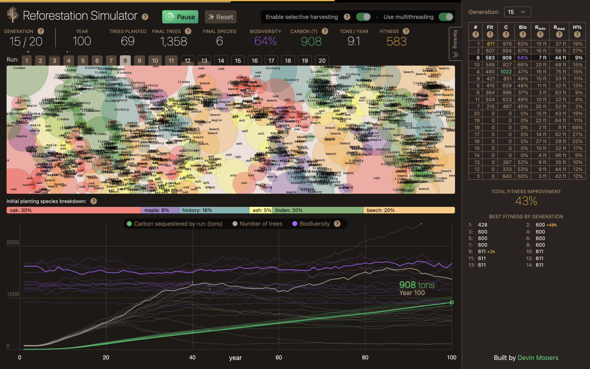

# Reforestation Simulator

A reforestation simulator that uses a genetic algorithm to try to find reforestation scenarios that maximize both carbon sequestration *and* biodiversity.


Uses multithreading via web workers.

Built with SvelteKit, Tailwind, and TypeScript as a frontend dev portfolio project by [Devin Mooers](https://devinmooers.com).

## [Live Demo »](https://reforestationsimulator.netlify.app/)  

## Screenshot


## Genetic Algorithm Overview

Here's the basic process the algorithm goes through:

- Creates 20 individual scenarios with a random percentage mix of tree species, and random selective harvesting parameters (selective harvesting can be disabled via UI toggle)
- Attempts to plants up to 200 trees on 1 acre of land for each scenario (though it will usually plant fewer than that because the declustering algorithm, based on final canopy size, doesn't generally allow 200 trees to be placed on 1 acre)
- Runs 100 years of tree growth by simulating seed propagation and calculating the sunlight available to each tree
- At each year step, kills trees that have severely degraded health due to being constantly restricted of sunlight for a string of years (relative to their shade tolerance), and adds their embodied carbon to the sequestered carbon bank for that run (assuming composting / fungal breakdown, rather than e.g. burning)
- At each year step, selectively harvests trees according to selective harvesting parameters for that scenario (if selective harvesting module is enabled)
- After 100 years of simulation, evalutes the fitness of each scenario by multiplying together carbon sequestration and biodiversity
- Preserves 2 elites with the highest fitness to move to the next generation
- Selects the remaining 18 individuals for the next generation using mutation and crossover. For crossover, it chooses parents preferentially from higher-fitness individuals, with an exponentially decreasing but nonzero chance of choosing lower-fitness individuals. Mutation is applied to crossover individuals, and the rate is aggressively high to try to prevent getting stuck in local optima (but perhaps too high? hyperparameter tuning could shed light on this).

## Todos

- Implement quadtree algorithm for finding nearest tree neighbors when calculating shading for each tree to speed up simulation
- Implement a shade map algorithm:
  - At each year step, build a shade map from the shade of each tree (perhaps multiple z-layers of shade maps to approximate vertical shading / height differences)
  - For each tree, to calculate its own shading, subtract its shade from the shade map, and sum the total sunlight available to it over its own canopy area; Use this value for calculating yearly growth, food production, seed production, and health
  - This may be significantly slower than the current implementation, but it's hard to say - the current approach takes a lot of time to find the nearest trees. The bitmap appraoch could perhaps be greatly sped up by using a GPU-accelerated approach (e.g. <canvas> rendering)
- Add more accurate carbon calculation based on DBH (diameter at breast height)
- Refine existing logistic tree growth equation with actual empirical constants for each tree species
- Individually track DBH and canopy spread of trees, rather than just canopy spread, understanding that trees tend to grow bushier in full sunlight, and taller/skinnier in restricted sunlight

## Caveats

I am not an expert in tree growth dynamics or ecology, so there are many assumptions and simplifications in this model, made for prototyping purposes, that do not reflect reality. For instance, the tree shading algorithm does not account for the sun's elevation, but instead assumes overhead sun, and uses a rough approximation of vertically varying shading caused by different tree heights and canopy spreads. A more physically accurate implementation might be to render a bitmap of shadows for all trees (a shade map), and then when calculating the sunlight available to a single tree, subtract that tree's shadow from the overall shade map and use the result to calculate the sun available to that tree.

Also, currently each scenario is only run once, but should be run multiple times (perhasps 5-10 times?), and than have the resulting fitnesses averaged together before selection of the next generation, to account for the random variation in initial tree placement, tree seeding, and selective harvesting on each individual run (which could erroneously send lower-quality scenarios to the next generation if they chanced upon a unusually good confluence of random parameters in a single run).

## Controls

If you disable multithreading via the UI toggle, you can run the app in single-worker mode, during which you'll be able to see year-by-year tree growth updates, rather than just the final result of 100 years of tree growth for each scenario.

## Tree Species

This app uses 6 Northeastern US tree species for prototyping. Tree species data, found in `src/lib/treeSpecies.ts`, including growth rate, shade tolerance, and maximum canopy spread, are loosely based on reality. Canopy spread is the most physically accurate number, but the other values are mainly ad-hoc for prototyping purposes.

## Modifying Parameters

The main genetic algorithm, run orchestration logic, and hyperparamters are contained in `src/lib/simulator.ts`, including things like the number of worker threads, population size, years per run, generations per run, etc. Many constants can be changed there, including the random ranges of parameters used to create the first generation of scenarios.

The tree growth simulation parameters, including growth rate, seed density, etc., can be modified in `src/lib/simulation.worker.ts`.

## Developing

Once you've installed dependencies with `npm install` (or `pnpm install` or `yarn`), start a development server:

```bash
npm run dev
```

## Building

To create a production version of your app:

```bash
npm run build
```

You can preview the production build with `npm run preview`.

> To deploy your app, you may need to install an [adapter](https://kit.svelte.dev/docs/adapters) for your target environment.
